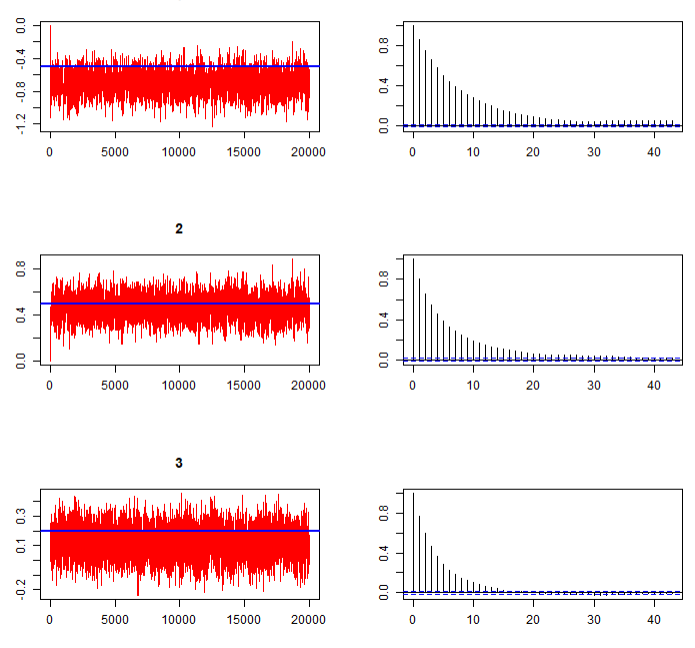
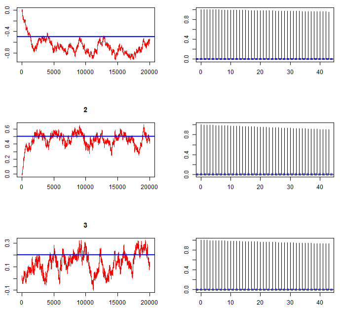
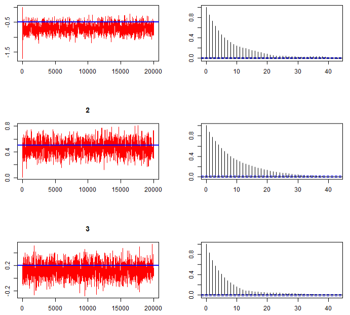
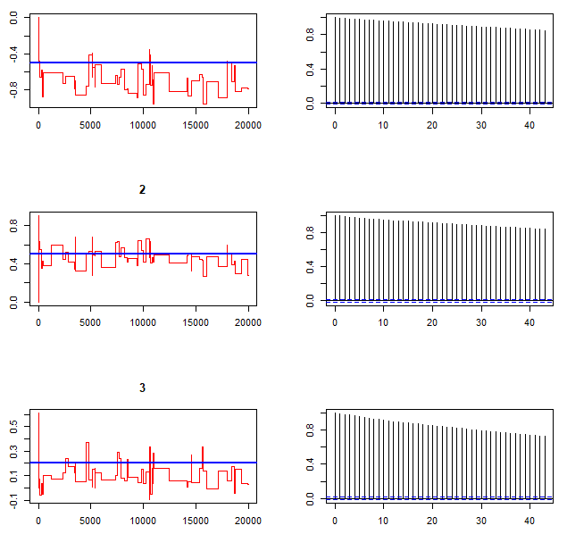
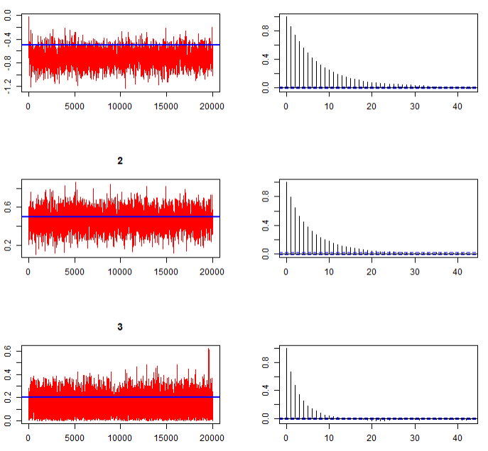
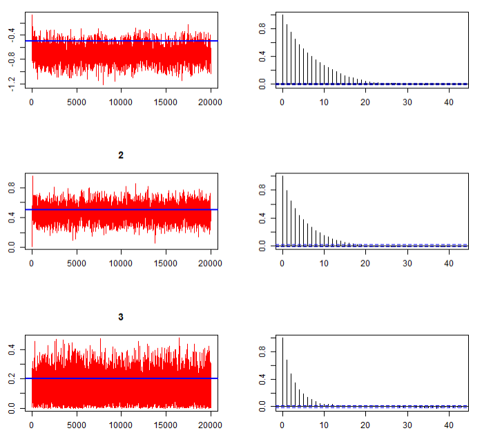
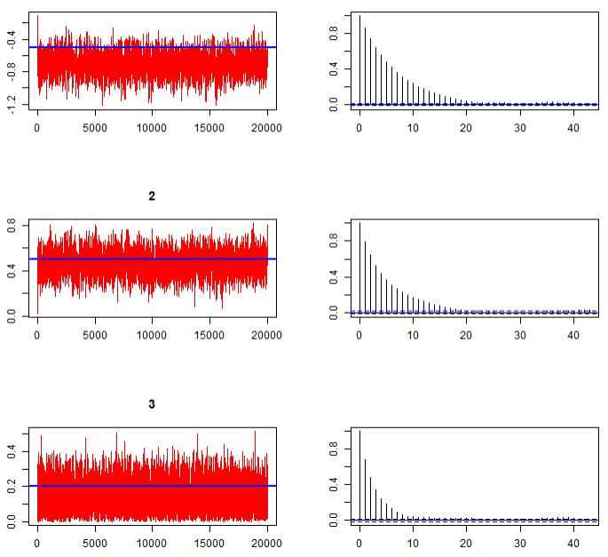
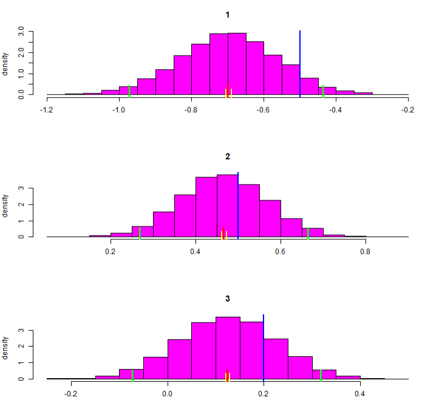
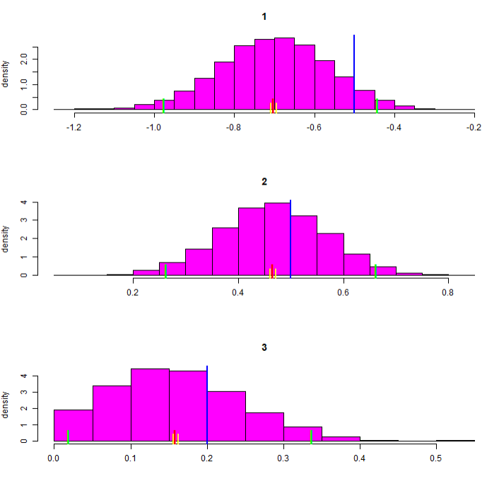
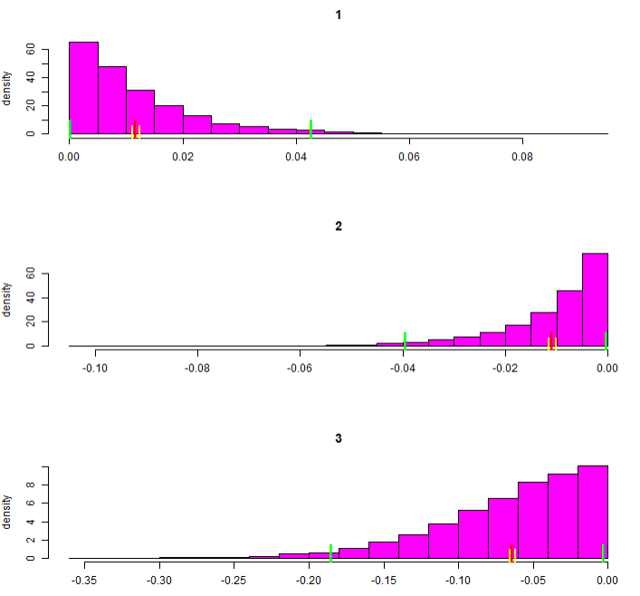

# Homework 3

## Task 1

For this task, I created 3 models for the single move and multi move RH sampler. I varied the step size of the Samplers between 0.005, 0.1 and 1 to evaluate the impact of step size on autocorrelation and acceptance rate.
The following table captures the acceptance rates for the different models. Note, that the multi move RH sampler has only one acceptance rate as all paramters will be updated jointly. The single move RH sampler has acceptance rates for each of the 3 data generating values. We can see that the acceptance rate is by far the highest for the small step size, which is what I would have expected. The large step size results in low acceptance rates.

The biggest difference between single move and multi move samplers is when the step size is 0.1. The acceptance rate is significantly higher for the single move sampler in this setup.

| **Model**                |Step size| **Acceptance Rate (%)** 
|--------------------------|---------|------------------------
| **outRW_noTune**         |    0.10     |46.28                    
| **outRW_noTune_ssmall**  |     0.005    |96.80                     
| **outRW_noTune_sbig**    |    1     |0.42                     
| **outSM**                |     0.10    |74.98 / 67.55 / 70.97   
| **outSM_small**          |      0.005   |98.41 / 98.14 / 98.61   
| **outSM_sbig**           |    1     |15.14 / 11.43 / 13.07   

The following plots show the autocorrelation of the 3 different models for the single move RH sampler. As we cann see, the sampler with small step size has an incredibly high autocorrelation, which indicates low efficiency in discovering the parameter space.

The plots for the multi move sampler look very similar for the step sizes 0.1 and 0.005. That's why I leave some out here. Interestingly, the autocorrelation is significantly higher for the multi move sampler with step size 1 in comparison to that of the single move sampler:

\clearpage
\newpage

## Task 2

For this task, I will use the single move sampler with the three different step sizes from above.

### Part 1 - Comparison of acceptance rates and autocorrelation

The acceptance rates for the three different models are very similar when applying truncation. The explanation for this might be, that the search space is limited and therefore the possible space is more narrow and results become more similar. I am still surprised that the values are so close together, especially for the small step size and large step, which had very different acceptance rates before.

| Model              | Step Size (sbeta) | Acceptance Rate (%) |  
|--------------------|-------------------|---------------------|  
| **outSM**          | 0.1               | 75.39 68.04 77.6    |  
| **outSM_small**    | 0.005             | 75.09 67.98 77.83   |  
| **outSM_sbig**     | 1                 | 75.43 67.68 77.62   |  

The autocorrelation of all three models now also loks very similar. This is also a huge contrast to the results from Task 1, where we saw clear differences.

\clearpage
\newpage

### Part 2 - Comparing posterior distributions

The main differnce in the posterior distributions between Task 1 and Task 2, is that the third value is restricted to be positive in Task 2. This means, that the fit is slightly better, as more mass of the posterior distribution is now near the correct mean of 0.2. For the other parameters, there are not really any effects as the mass of the posterior lies further away from 0.

\clearpage
\newpage

## Task 3

When the constrainst are inconsistent, we can see that the highest mass of the posterior lies at the border to 0 for each of the three parameters. This is to be expected. Because the mean of parameter 3 is closest to 0, this parameter has the highest acceptance rate with over 50%. In total, the model fit is apparently worse than with constraints that were consistent with the underlying parameter values.

| **Model**                    | **Step Size** | **Acceptance Rate (%)**       |
|------------------------------|-------------------------|-------------------------------|
| **outSM**  | 0.1                     | 16.24 14.54 55.16             |
| **outSM_small** | 0.005                   | 16.37 15.28 54.23             |
| **outSM_sbig** | 1                       | 16.7  15.22 55.17             |

