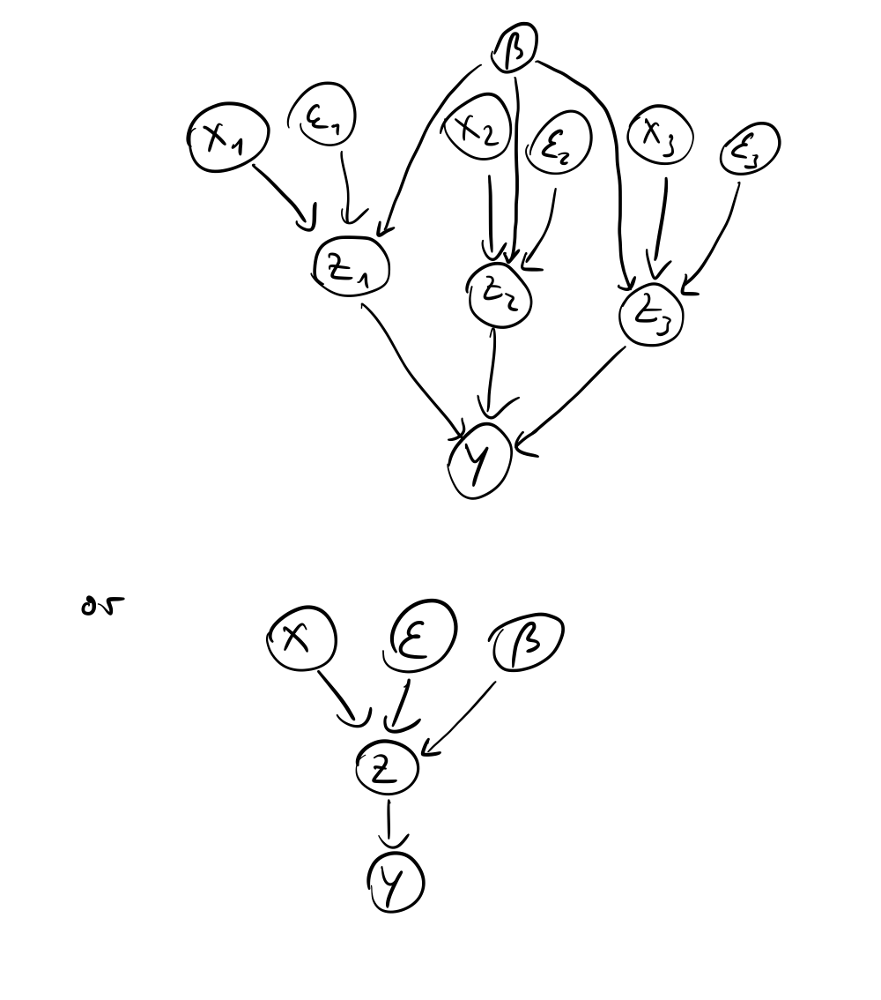
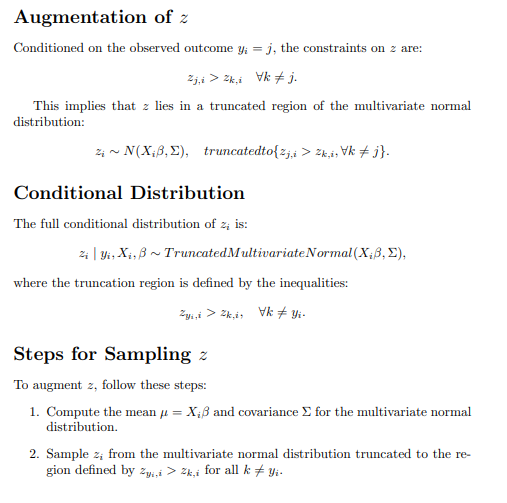
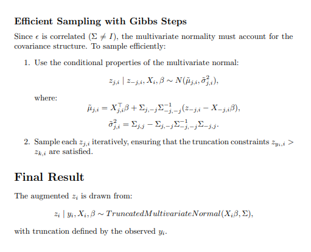

# Homework 4

## Task 1
I have drawn the graph once in an aggregated manner and once disaggregated.

## Task 2
Look at code 'Task2.R'

## Task 3
I wrote code for this task, see Augmenting_z.R. The main idea is that once we find the maximum $z_{j,i}$ with the indicator function, we resample the z's based on the observed $y_i$ and introduce truncation of the $z_{k,i} \neq z_{j,i}$.

In the Multinomial Probit (MNProbit) model, we need the full conditional distributions for:
1. The latent variables $z_{j,i}$, given the observed data $y_i$ and parameters $\beta$.
2. The parameter vector $\beta$, given the latent variables $z_{j,i}$ and predictors $x_{j,i}$.

---

## 1. Full Conditional Distribution of $z_{j,i}$

The latent variables $z_{j,i}$ are modeled as:

$z_{j,i} = {x}_{j,i}^\top \beta + \epsilon_{j,i}, \quad \epsilon_{j,i} \sim N(0, 1)$

### Key Idea
- We observe $y_i$, which indicates the index of the maximum $z_{j,i}$.
- Therefore, $z_{j,i}$ is **truncated** based on $y_i$:
  - If $y_i = j$, then $z_{j,i} > z_{k,i}$ for all $k \neq j$ (meaning $z_{j,i} is unrestricted above).
  - If $y_i \neq j$, then $z_{j,i} \leq z_{y_i,i}$ (this means $z_{j,i}$ is restricted to lie below the maximum).

### Conditional Distribution
The full conditional distribution for $z_{j,i}$ is:

$z_{j,i} | y_i, x_{j,i}, \beta \sim \text{Truncated Normal}({x}_{j,i}^\top \beta, 1, L, U)$
The mean of the untruncated normal distribution is $$ x_{j,i}^\top \beta . $$
 
The standard deviation is  1 and the truncation bounds L and U are determined as:

- For the chosen alternative $ j = y_i $:
$$ L = \max_{k \neq j} z_{k,i}, \quad U = \infty $$

- For the non-chosen alternatives $$ j \neq y_i $$:

$$ L = -\infty, \quad U = z_{y_i,i} $$

## Task 4 and 5

I used the provided R file rbprobitGibbs as a basis for creating a Gibbs sampler. I had some trouble creating a sampler that runs without errors. 

The last part of the file simulates data for the binary probit model. The n corresponds to the number of observations, the p determines the number of predictors (dimension of beta). Then I randomly set the true parameters of beta and try to recover them using the Gibbs Sampler. As a result, the Gibbs Sampler recovered parameters that were quite close to the true ones. Small deviations might be explained by the specification of priors.

| Parameter | True Beta | Posterior Mean Beta |
|---|---|---|
| beta_1 | -0.424845 | -0.4821123 |
| beta_2 | 0.5766103 | 0.6757679 |
| beta-_3 | -0.1820462 | -0.1705051 |
| beta_4 | 0.7660348 | 0.7516217 |
| beta_5 | 0.8809346 | 1.098932 |

## Task 6
As I use markdown and just compile to pdf, the Latex Notation causes some issues sometimes. Therefore; I formatted in latex and just copy and pasted screenshots from that in here:

