# Homework 5

## Task 1
The first part of the code draws two samples from a multivariate normal. The second sample with 200,000 observations is labeled as the population and the sample with 1,000 observations is the actual sample.
In the current form, lines 28 and 29 are not necessary in my understanding. If the matrix is diagonal, then the transpose of the sigma matrix is the sigma matrix itself. The lower triangular matrix is just 0 and therefore the updating in line 29 has no effect.

The simmnlv2 function goes through each individual and creates 21 rows, which corresponds to the number of options (3: Brand A, Brand B, Outside option) and the number of choices (7: This is set in line 131 with cmax=7). A random price between 0.5 and 3 is added for each of the 21 options. However, because of vertical differentiation and the fact that consumer weakly prefer Brand A over Brand B at the same price, the price for brand A is made larger than brand B. If the brands had the same price, Brand A would be chosen in the majority of the cases. The price for the outside option is set to 0, as it should probably act as a baseline. Based on the generated betas earlier, the softmax function is applied for the 7 choices. The function then returns the choices y, the attribute matrix X, the betas and the softmax probabilites which is saved in the variable "hdata". 

For each person, the probabilities for the MNL function will depend on the betas drawn in the first step. This is basically the lower level of the hierarchy and is saved in the betaexchange variable. The population level posterior draws for mu are stored in bbarmc.

## Task 2

In the beginning, I was a little confused because I thought the constrained was meant to be in line 36, where -exp(betastar[,1]) made sure the price coefficient is negative. But I guess the constrained that is referred to should be implemented in the function rhierMnlRwMixture().

## Unconstrained model

I first use the already implemented model without a constraint during estimation. 

### Convergence
Convergence is assessed by looking at the log likelihood, which is an output of the rhierMnlRwMixture function of bayesm. There are 12,000 MCMC iterations but only every second draw is kept, which results in 6000 draws of the posterior.

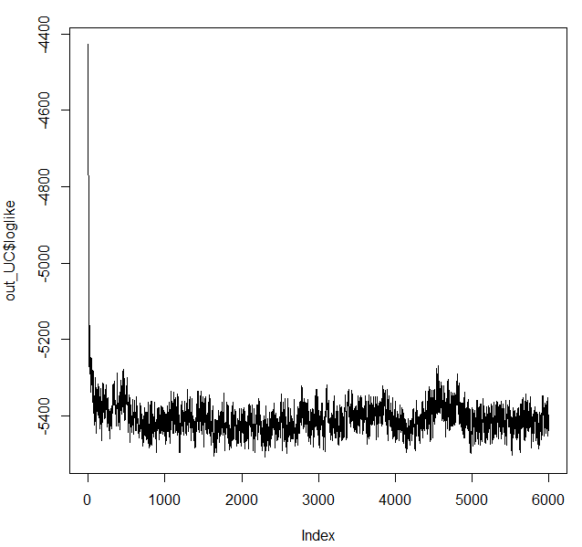

As can be seen, the posterior converges relatively fast.

### Individual Level

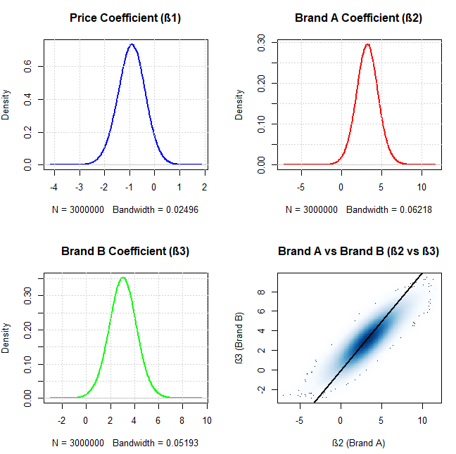

| Statistic |Price        | Brand A   | Brand B |
|-----------|-------------|-----------|-----------|
| mean      | -0.9113044  | 3.255119  | 3.043742  |
| median    | -0.9057864  | 3.252144  | 3.043987  |
| sd        | 0.5521023   | 1.401991  | 1.154832  |
| min       | -4.1060397  | -7.050056 | -2.883443 |
| max       | 1.8087431   | 11.546431 | 9.424948  |

From the plots in Figure 2 and the above table we can see that the mean of the price coefficient is close to -1 but positive values are possible. Clearly, the price coefficient is then unconstrained wrt to the sign. They also confirm that the coefficient for brand A is 

### Population Level

The true values for the distribution are: 

| Statistic | Price        | Brand A     | Brand B     |
|-----------|--------------|-------------|-------------|
| 1%        | -2.9285749   | 0.8069232   | 0.6550899   |
| 25%       | -1.1845266   | 2.4917215   | 2.3246564   |
| 50%       | -0.8188655   | 3.1718137   | 2.9988679   |
| 75%       | -0.5662590   | 3.8576077   | 3.6754156   |
| 99%       | -0.2289567   | 5.5368492   | 5.3321445   |
| Mean      | -0.9521361   | 3.1738355   | 2.9995742   |
| Variance  | 0.3190997    | 1.0248940   | 1.0047257   |

These were obtained in the beginning, when drawing the sample with size 200,000.
In the graph below, we can see that the posterior converges to the mean of the coefficients. Also the results in the table suggest that the posterior mean is close to the actual mean. The 99-percentile from the posterior deviates quite a bit from the 'true' distribution, as there seem to be less extreme results for the coefficients of brand A and brand B in the posterior.
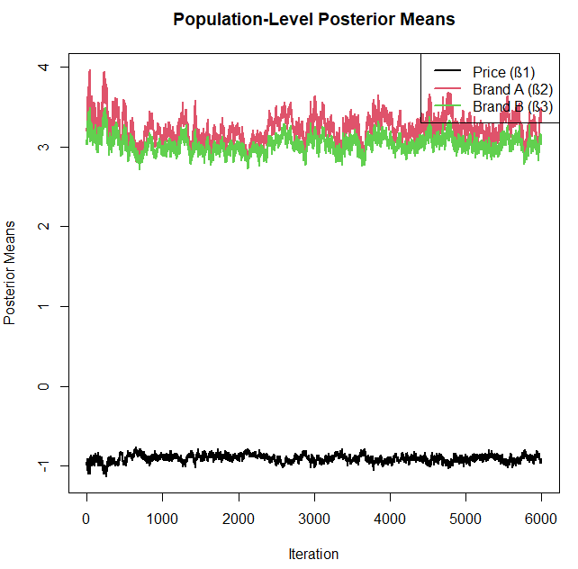

| Posterior Statistic | ß1 (Price)   | ß2 (Brand A) | ß3 (Brand B) |
|-----------|--------------|---------------|--------------|
| 1%        | -1.02341940  | 2.9032234     | 2.8136068    |
| 25%       | -0.93575191  | 3.1249178     | 2.9619093    |
| 50%       | -0.90347868  | 3.2283403     | 3.0279034    |
| 75%       | -0.87357345  | 3.3386255     | 3.1003460    |
| 99%       | -0.80811234  | 3.6599996     | 3.3129495    |
| Mean      | -0.90559831  | 3.2342114     | 3.0335286    |
| Median    | -0.90347868  | 3.2283403     | 3.0279034    |
| SD        | 0.04575919   | 0.1615062     | 0.1055757    |

\newpage

## Sign-constrained model

As far as I understand the bayesm function rhierMnlRwMixture, a way to impose sign constraints is via the attribute "SignRes" in the Prior. As the function says, a -1 means the sign is restricted to be negative whereas the 0 signals that we do not impose any constraints. I therefore set a -1 for the price coefficient.

### Convergence
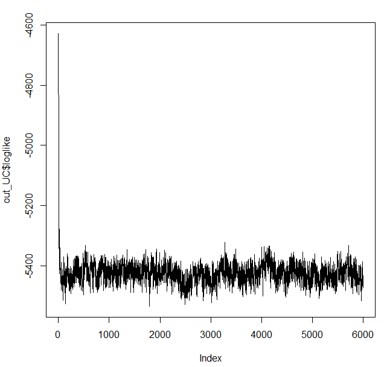

### Individual Level

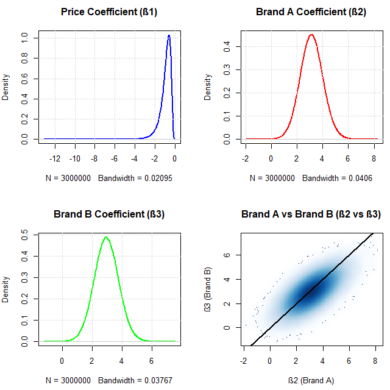

| Statistic | Price       | Brand A    | Brand B    |
|-----------|-------------|------------|------------|
| mean      | -0.94465398 | 3.1469076  | 2.9590318  |
| median    | -0.81010759 | 3.1395774  | 2.9558038  |
| sd        | 0.57383225  | 0.8992792  | 0.8290096  |
| min       | -13.04578515| -1.8435732 | -1.1535852 |
| max       | -0.04114773 | 8.1557643  | 7.4769602  |

It seems, the method to constrain the price coefficient described above works, since all price coefficients are negative. The main differnce to the unconstrained model is that the price coefficient does not take any positive values. The distributions of brand A and be B seem to be similar in the constrained and unconstrained model.

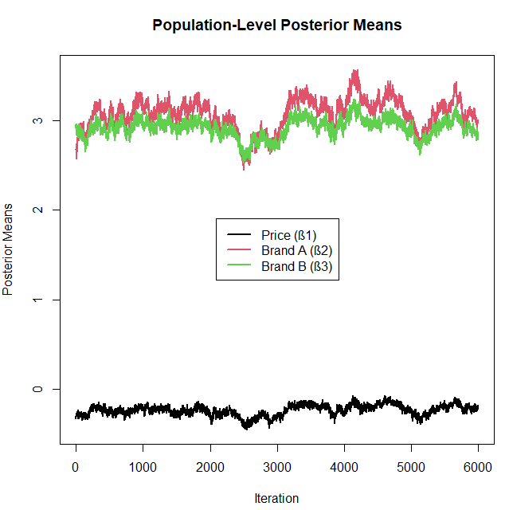

| Statistic | ß1 (Price)   | ß2 (Brand A) | ß3 (Brand B) |
|-----------|--------------|--------------|--------------|
| 1%        | -0.40183444  | 2.5917879    | 2.6245857    |
| 25%       | -0.27971877  | 2.9763384    | 2.8606004    |
| 50%       | -0.23396800  | 3.1024895    | 2.9381866    |
| 75%       | -0.19660969  | 3.1999462    | 2.9999614    |
| 99%       | -0.11928144  | 3.4667701    | 3.1547363    |
| Mean      | -0.23963398  | 3.0767455    | 2.9248191    |
| Median    | -0.23396800  | 3.1024895    | 2.9381866    |
| SD        | 0.06045113   | 0.1775213    | 0.1086277    |

Interestingly, the posterior of the sign-constrained model converges to a price coefficient that is closer to 0 compared with the unconstrained model. This seems to be counterintuitive as we constrained the price coefficient to be negative. 

\newpage

## Task 3
To run the results of this task, you have to set cmax to 60 or cmax_2 in line 134 in each of the two scripts.

## Unconstrained model

### Individual Level
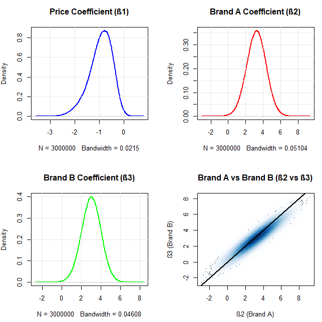

| Statistic |Price        | Brand A   | Brand B |
|-----------|-------------|-----------|-----------|
| mean      | -0.9465049  | 3.232400  | 3.029090  |
| median    | -0.8946408  | 3.240616  | 3.038300  |
| sd        | 0.4784173   | 1.119699  | 1.011272  |
| min       | -3.5415814  | -2.887219 | -2.565272 |
| max       | 0.7357450   | 9.189662  | 8.255655  |

The posterior mean does not change much. The standard deviation is slightly lower for the model with 60 choices. The main difference seems to be the distribution of the price coefficient. In the model with 60 choices, the left tail is thicker and the peak of the distribution seems to be slightly closer to 0. However, there are less positive values compared to the unconstrained model in 2. Generally, the standard deviation is visibly lower in the model with 60 choices.

### Population level
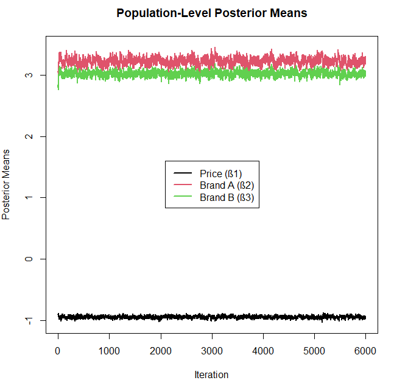

| Statistic | ß1 (Price)   | ß2 (Brand A) | ß3 (Brand B) |
|-----------|--------------|--------------|--------------|
| 1%        | -0.99417093  | 3.09530541   | 2.92727905   |
| 25%       | -0.96043695  | 3.19064771   | 2.99808942   |
| 50%       | -0.94656391  | 3.23328015   | 3.02925826   |
| 75%       | -0.93288521  | 3.27243902   | 3.05733721   |
| 99%       | -0.90030231  | 3.37493470   | 3.12985741   |
| Mean      | -0.94669328  | 3.23194395   | 3.02796877   |
| Median    | -0.94656391  | 3.23328015   | 3.02925826   |
| SD        | 0.02029635   | 0.06035766   | 0.04410065   |

The variance is definitely lower when having the 60 choices. This can be seen graphically in the last graph, as the draws are nearly flat. Moreover, numerically it is shown by the SD deviation, which is lower in the models with 60 choices. The posterior mean did not change at all.

\newpage

## Sign-Constrained model

### Convergence
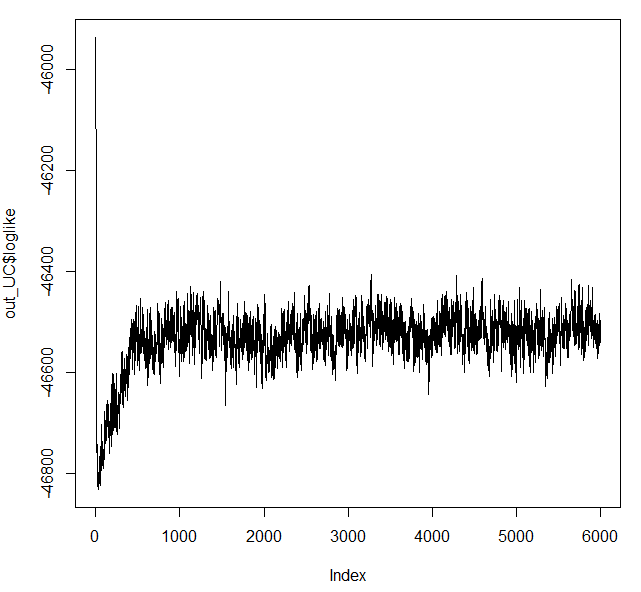

### Individual Level
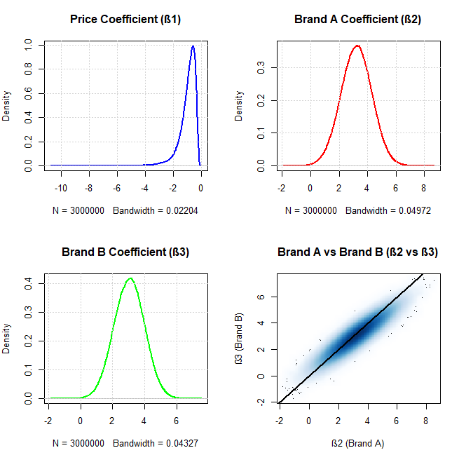

| Statistic | Price       | Brand A   | Brand B   |
|-----------|-------------|-----------|-----------|
| mean      | -0.97894568 | 3.226893  | 3.0367992 |
| median    | -0.82939089 | 3.232778  | 3.0442661 |
| sd        | 0.62578062  | 1.090662  | 0.9491584 |
| min       | -10.71609833| -1.793350 | -1.7479374|
| max       | -0.05345165 | 8.540275  | 7.3987928 |

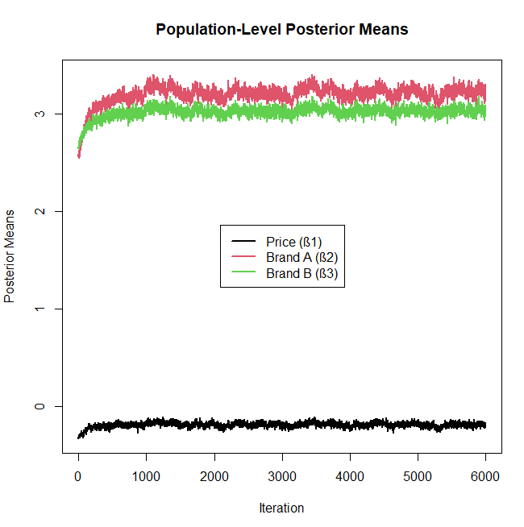

| Statistic | ß1 (Price)   | ß2 (Brand A) | ß3 (Brand B) |
|-----------|--------------|--------------|--------------|
| 1%        | -0.27982216  | 2.7812150    | 2.78117788   |
| 25%       | -0.20488542  | 3.1710020    | 2.99817749   |
| 50%       | -0.18794441  | 3.2132474    | 3.02806413   |
| 75%       | -0.17158750  | 3.2564814    | 3.05769397   |
| 99%       | -0.13141813  | 3.3551198    | 3.13010993   |
| Mean      | -0.18928923  | 3.2034606    | 3.02270285   |
| Median    | -0.18794441  | 3.2132474    | 3.02806413   |
| SD        | 0.02676767   | 0.0924153    | 0.05856231   |

For the sign-constrained model, we see again a convergence to a price coefficient that is actually closer to 0. The standard deviation is markably lower.

\newpage

# Task 4

Brand A's profit function can be written as:

$$ \pi_A(p_A) = (p_A - c_A)*Q_A(p_A) $$

Furthermore, we assume brand A's marginal cost c_A are equal to 1. The demand function $$ Q_A $$ can be obatined by the number of consumer times the probability for choosing Brand A: $$ Q_A(p_A) = N * P_A(p_A) $$

I Use logit choice probability:

$$ P_A = \frac{\exp(U_A)}{\exp(U_A) + \exp(U_B) + 1} $$

where $$ U_A = \beta_1 \cdot p_A + \beta_2 \cdot p_B $$
Then using the R package `optim()` with the `L-BFGS-B` method to maximize profit:
$$ p_A^* = \arg\max_{p_A} \pi_A $$
I set constraints on the price to be between 0 and 5, which seemed to be a reasonable interval : $$ p_A \in [0, 5] $$ However, for the sign-constrained model I found out that with this given interval the optimal price would be 5. Hence, I increased the interval for this case to 20.

You can find the code to optimize the price for Brand A at the end of the R script. 

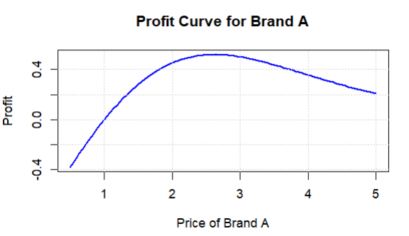
As can be seen from Figure 12, the most profit for the unconstrained model can be generated with a price between 2 and 3. More spefically, a price of 2.63 maximizes profits. 

For the sign-constrained model, I get a completely different result:
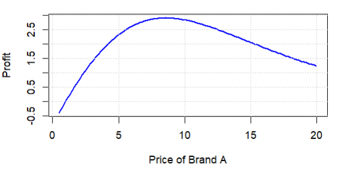
The optmizing price is 8.57 which does not seem to be very likely since the marginal cost of Brand A is 1.
