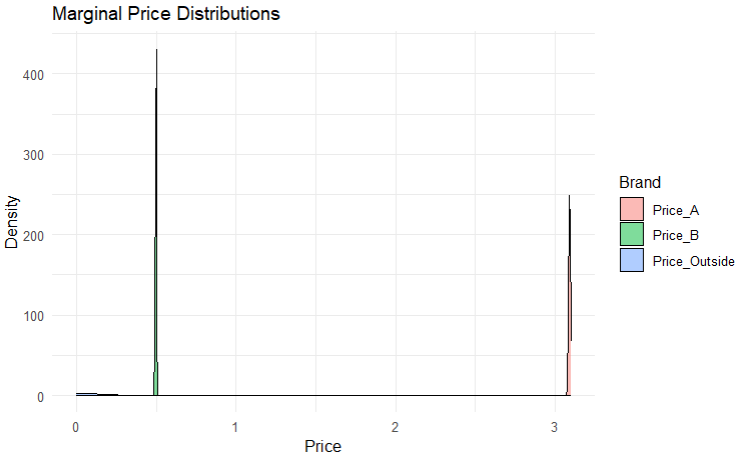
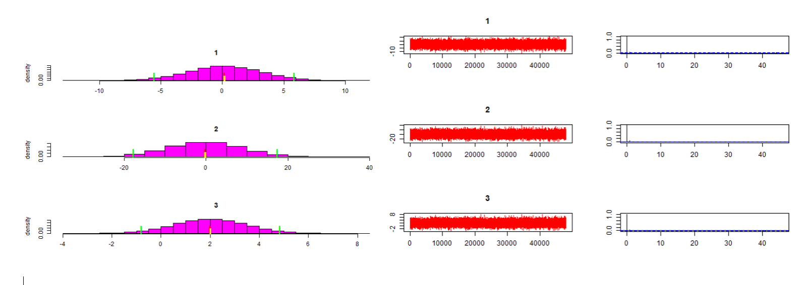

# Homework 6

## Task 1

I first created a dataframe of the provided RData file. When looking at the prices, I realized that the difference within the brands were very small. This can be seen by the following table as well:

| Brand          | Price.Min. | Price.1st Qu. | Price.Median | Price.Mean | Price.3rd Qu. | Price.Max. |
|----------------|------------|---------------|--------------|------------|---------------|------------|
| Price_A        | 3.0801068  | 3.0871148     | 3.0899857    | 3.0900117  | 3.0929485     | 3.0997759  |
| Price_B        | 0.4900026  | 0.4924996     | 0.4948924    | 0.4949724  | 0.4975153     | 0.4999981  |
| Price_Outside  | 0.0000000  | 0.0000000     | 0.0000000    | 0.0000000  | 0.0000000     | 0.0000000  |

Notice that the minimum and maximum price for each brand are close to each other, meaning that there is not much price variation. I am not sure if this was planned, as the prices differed much more in the last homework. When I used the data simulation that was mentionend at then end of the task descriptions, I also got prices for the brands with more variance. I literally just imported the dataset and did not change anything in the data myself. 

In the first plot, we can also see that the distribution is peaky for brand A and brand B. As there is a grouping into colors by brand, the plot reveals essentially already the brand-conditional price distribution.




## Task 2
Because of the huge price differences between Brand A and Brand B, it seems obvious that Brand B will be preferred by most consumers. This can also seen by the count of overall brand preferences across all observations of all consumers (7000 total). For each consumer, we have 7 observations. 

| Brand           | Count |
|-----------------|-------|
| Brand_A         | 972   |
| Brand_B         | 5375  |
| Outside_Option  | 653   |

This corresponds to the following share:

| Brand           | Proportion   |
|-----------------|--------------|
| Brand_A         | 0.13885714   |
| Brand_B         | 0.76785714   |
| Outside_Option  | 0.09328571   |

Generally, 220 consumers only chose one Brand across the 7 choice tasks. And in ALL cases, Brand B was the Brand that consumers chose. This suggests that the prices in the data make Brand B more attractive compared to Brand A and the outside option. Although, every consumer prefers Brand A weakly at the same price, Brand B is generally the favourite as the prices are not close to each other. Brand B is actually much closer to the outside option, as the analysis in Task 1 revealed.

## Task 3
The data doesnt say anything about price sensitivity, because basically the prices are fixed for the three brands. This is obviously not great for a researcher as we cannot learn too much about price sensitivity. Generally, the data is very uniformative about brand preference and price sensitivity (if the data that I have is correct).

## Task 4
For this task I wrote the script in file "Task4.R", which fits the rmnlIndepMetrop model from bayesm to the data.

| Moments | mean | std dev | num se | rel eff | sam size |
|---------|------|---------|--------|---------|----------|
| 1       | 0.18 | 2.9     | 0.0144 | 1.1     | 21600    |
| 2       | -0.16| 9.0     | 0.0445 | 1.1     | 21600    |
| 3       | 2.02 | 1.4     | 0.0071 | 1.1     | 21600    |

| Quantiles | 2.5% | 5%    | 50%   | 95%  | 97.5% |
|-----------|------|-------|-------|------|-------|
| 1         | -5.5 | -4.61 | 0.19  | 5.0  | 5.9   |
| 2         | -17.7| -14.92| -0.18 | 14.7 | 17.5  |
| 3         | -0.8 | -0.35 | 2.01  | 4.4  | 4.9   |



The coefficients are not identified well. Especially the second coefficient exhibits strong uncertainty. 

## Task 5
For this task, I could not get the provided code "SampleCallToRccp.R" to run. There was always the error:
"Error: $ operator is invalid for atomic vectors", which showed up when i was just running the plain script without modifications. The issue occured when calling the "rhierMnlRwMixture_SR" function in the last line. It is likely related to the input "Data" that might have a different structure as expected.
I tried to mitigate the issue by creating a new Data Variable which contains a list and add the p and the Z:
```R
Data <- list(
  p = 3,          
  lgtdata = E_Data,
  Z = NULL
)

# Hierarchical Model
out_order = rhierMnlRwMixture_SR(Data=Data,
                                 Prior=Prior,Mcmc=Mcmc,nvar_c=nvar_c,flag="approx")
```
But the error remained. The code "SampleCallToRccp.R" with my changes is also attached.