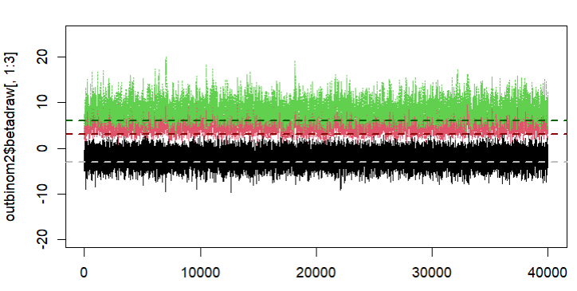
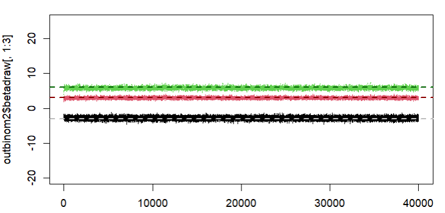
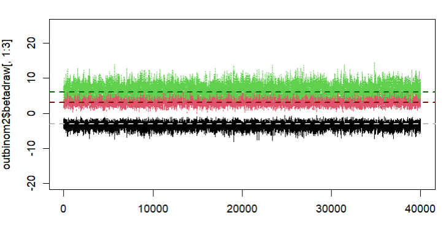
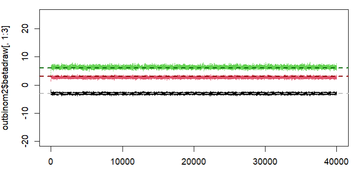
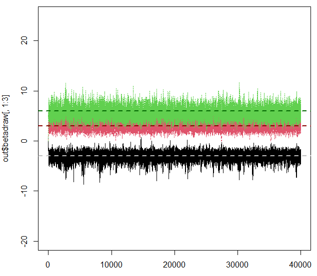
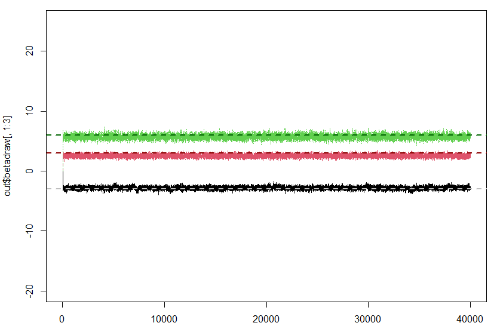
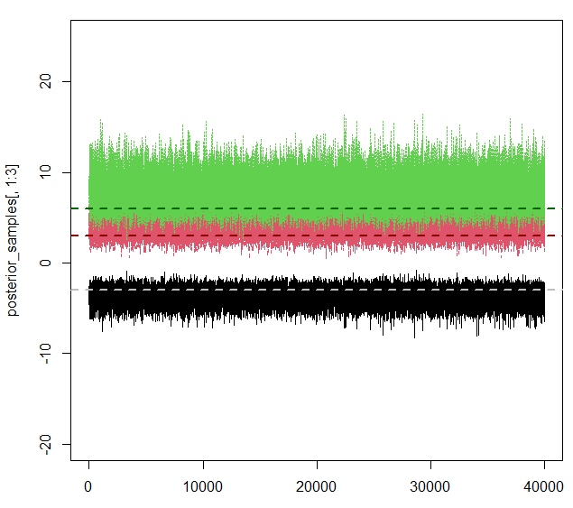

# Homework 7

## Task 1
### i)
Using the standard bayesm rbprobitGibbs function, with the 10 spurious covariates, 100 observations, R=200,000 and weakly informative prior, I get the following results:

| Moments | mean  | std dev | num se | rel eff | sam size |
|---------|-------|---------|--------|---------|----------|
| 1       | -2.385| 1.86    | 0.0184 | 3.5     | 9000     |
| 2       | 3.221 | 0.99    | 0.0135 | 6.7     | 5143     |
| 3       | 8.384 | 1.88    | 0.0400 | 16.4    | 2118     |
| 4       | 0.896 | 1.02    | 0.0105 | 3.8     | 9000     |
| 5       | 0.417 | 0.94    | 0.0089 | 3.2     | 9000     |
| 6       | -1.144| 0.97    | 0.0101 | 3.9     | 9000     |
| 7       | 1.415 | 0.97    | 0.0114 | 4.9     | 7200     |
| 8       | -0.684| 0.85    | 0.0077 | 2.9     | 12000    |
| 9       | 0.904 | 0.83    | 0.0070 | 2.6     | 12000    |
| 10      | -0.034| 0.85    | 0.0066 | 2.2     | 12000    |
| 11      | -0.229| 0.98    | 0.0100 | 3.8     | 9000     |
| 12      | -1.435| 0.91    | 0.0097 | 4.2     | 7200     |
| 13      | -1.855| 1.01    | 0.0118 | 5.0     | 7200     |

The table above and in the following represent a summary of the posterior marginal distribution.

We can see that the true data generating values for the first 3 variables are not really recovered and some of the spurious covariates have an impact on the model. The first variable is not even significant to the 5% level. Overall, the model selection basically fails.

When we use more observations, 1000 to be exact, then we get much more certainty in the estimates and they are closer to the data generating values. Variable 12 still is somewhat significant, but the overall model selection seems to work by far better compared to the previous one.

| Moments | mean  | std dev | num se | rel eff | sam size |
|---------|-------|---------|--------|---------|----------|
| 1       | -2.8052 | 0.42  | 0.0036 | 2.7     | 12000    |
| 2       | 2.9974  | 0.27  | 0.0031 | 4.5     | 7200     |
| 3       | 5.8463  | 0.37  | 0.0056 | 8.0     | 4000     |
| 4       | 0.2466  | 0.22  | 0.0015 | 1.6     | 18000    |
| 5       | -0.1252 | 0.23  | 0.0015 | 1.6     | 18000    |
| 6       | -0.0081 | 0.22  | 0.0014 | 1.5     | 18000    |
| 7       | 0.0086  | 0.24  | 0.0016 | 1.6     | 18000    |
| 8       | -0.3028 | 0.22  | 0.0016 | 1.9     | 18000    |
| 9       | -0.3048 | 0.22  | 0.0015 | 1.6     | 18000    |
| 10      | 0.1954  | 0.23  | 0.0016 | 1.9     | 18000    |
| 11      | -0.1601 | 0.22  | 0.0016 | 1.9     | 18000    |
| 12      | 0.4470  | 0.23  | 0.0016 | 1.7     | 18000    |
| 13      | -0.3300 | 0.22  | 0.0014 | 1.5     | 18000    |

Now, we turn to data generating probit model without spurious covariates:

| Moments | mean  | std dev | num se | rel eff | sam size |
|---------|-------|---------|--------|---------|----------|
| 1       | -3.5  | 0.87    | 0.016  | 11.4    | 3000     |
| 2       | 3.5   | 1.01    | 0.016  | 8.9     | 4000     |
| 3       | 7.2   | 1.49    | 0.030  | 14.3    | 2400     |

| Moments | mean  | std dev | num se | rel eff | sam size |
|---------|-------|---------|--------|---------|----------|
| 1       | -3.0  | 0.22    | 0.0028 | 5.8     | 6000     |
| 2       | 2.7   | 0.27    | 0.0028 | 4.0     | 9000     |
| 3       | 6.4   | 0.41    | 0.0061 | 8.1     | 4000     |

As expected, when using 1000 observations, the standard deviation is much lower and the posterior means are sligthly closer to the true values. Interestingly, the model with spurious covariates and 1000 observations has actually the most accurate estimates of the 3 parameters based on the posterior mean. However, the uncertainty in these coefficients is higher compared to the model without spurious covariates and 1000 observations.

\newpage

### ii)
For this model, I just used the provided script and ran the model with variable selection.

| Moments | mean    | std dev | num se  | rel eff | sam size |
|---------|---------|---------|---------|---------|----------|
| 1       | -3.1384 | 0.86    | 0.0209  | 21.3    | 1636     |
| 2       | 3.2838  | 0.89    | 0.0131  | 7.8     | 4500     |
| 3       | 5.6427  | 1.17    | 0.0181  | 8.6     | 4000     |
| 4       | -0.0143 | 0.15    | 0.0031  | 14.8    | 2400     |
| 5       | 0.0738  | 0.34    | 0.0118  | 43.8    | 818      |
| 6       | -0.0114 | 0.15    | 0.0028  | 12.3    | 2769     |
| 7       | 0.0061  | 0.11    | 0.0017  | 8.8     | 4000     |
| 8       | 0.0123  | 0.14    | 0.0029  | 16.4    | 2118     |
| 9       | 0.0384  | 0.23    | 0.0059  | 24.3    | 1440     |
| 10      | 0.1356  | 0.48    | 0.0209  | 69.1    | 514      |
| 11      | -0.0515 | 0.27    | 0.0096  | 45.2    | 783      |
| 12      | 0.0496  | 0.28    | 0.0095  | 42.8    | 837      |
| 13      | -0.0985 | 0.40    | 0.0170  | 64.1    | 554      |

The Variable Selection sampler with 100 observations works already quite well. The spurious covariates are not significant. However, the values are also not clearly 0. But as we will see, with more observations this issue will be improved with 1000 observations.

| Moments | mean    | std dev | num se  | rel eff | sam size |
|---------|---------|---------|---------|---------|----------|
| 1       | -2.8e+00| 0.2293  | 6.3e-03 | 27.3    | 1286     |
| 2       | 2.5e+00 | 0.2400  | 2.4e-03 | 3.7     | 9000     |
| 3       | 5.7e+00 | 0.3629  | 5.4e-03 | 8.1     | 4000     |
| 4       | -6.2e-02| 0.1794  | 1.1e-02 | 133.1   | 269      |
| 5       | -3.7e-03| 0.0393  | 1.8e-03 | 76.2    | 468      |
| 6       | 2.0e-04 | 0.0103  | 1.1e-04 | 4.4     | 7200     |
| 7       | -6.2e-03| 0.0526  | 2.4e-03 | 72.9    | 493      |
| 8       | 1.8e-04 | 0.0118  | 1.0e-04 | 2.7     | 12000    |
| 9       | 9.8e-03 | 0.0709  | 3.4e-03 | 82.8    | 434      |
| 10      | 4.9e-05 | 0.0166  | 8.8e-05 | 1.0     | 18000    |
| 11      | -8.1e-05| 0.0082  | 6.5e-05 | 2.3     | 12000    |
| 12      | 4.6e-04 | 0.0143  | 2.4e-04 | 10.5    | 3273     |
| 13      | 1.7e-02 | 0.0935  | 5.1e-03 | 106.7   | 336      |

For 1000 observations, the variable selection sampler performs considerably well, filtering out the spurious covariates and converging to the data generating parameters.
Generally, the variable selection works much better as the standard bayesm routine, as was expected.

### iii)

For running the model in Stan I created the two files "probit_model.stan" and "Run_Stan.R". The output from Stan that I got looked like this:

| Parameter | mean  | se_mean | sd   | 2.5%  | 25%  | 50%  | 75%  | 97.5% | n_eff | Rhat |
|-----------|-------|---------|------|-------|------|------|------|-------|-------|------|
| beta[1]   | -3.71 | 0.01    | 0.86 | -5.52 | -4.26| -3.67| -3.10| -2.16 | 8683  | 1    |
| beta[2]   | 4.22  | 0.01    | 1.16 | 2.11  | 3.41 | 4.16 | 4.96 | 6.66  | 9857  | 1    |
| beta[3]   | 7.92  | 0.02    | 1.73 | 4.88  | 6.70 | 7.80 | 9.01 | 11.63 | 9816  | 1    |

Even without spurious covariates, the estimates for the 3 parameters are quite a bit off. Numerically and graphically, we can see that the variance is quite high, especially for the third coefficient.

## Task 2
The code for this task is at the end of the varselmain.R file. For the model with the 10 obfuscating covariates:

### i)
n=100: -26.51 

n=1000: -302.67

### ii)
n=100: -44.32

n=1000: -318.9

### iii)
n=100: -39.30

n=1000: -315.26

### iv)
n=100: -2.40

n=1000: -273.38

The marginal likelihood is generally larger for the model with 100 observations. This should be due to the fact that the individual log likelihoods are summed and if we have more observations we add more negative values.
The order of magnitude is roughly the same for the models. Just the value for bridgesampling with 100 observations is much larger than the rest. One other point to note is that the stan model also takes a long time to compute. (I did not uncomment the set.seed(66) for this task, therefore the results might be different when running with the seed. For the below task, I set the seed and results should be reproducible).

For the data generating model:

### i)
n=100: -21.14

n=1000: -291.36

### ii)
n=100: -26.29

n=1000: -272.21

### iii)
n=100: -26.98

n=1000: -262.72

### iv)
n=100: -16.62

n=1000: -253.37

For the data generating model, I don't see huge differences between the 4 methods. The bridgesampling has again a higher log marginal likelihood, but the differences is not as stark as before for the model with 10 spurious covariates. To conclude, the 4 methods give quite similar results for the marginal likelihood.