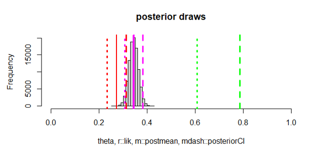
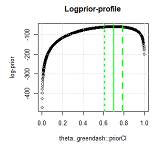
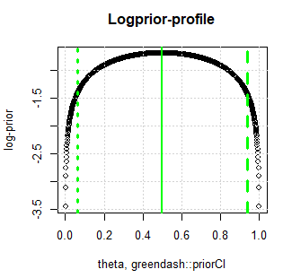
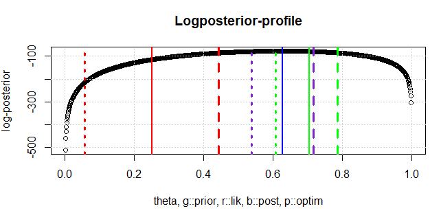
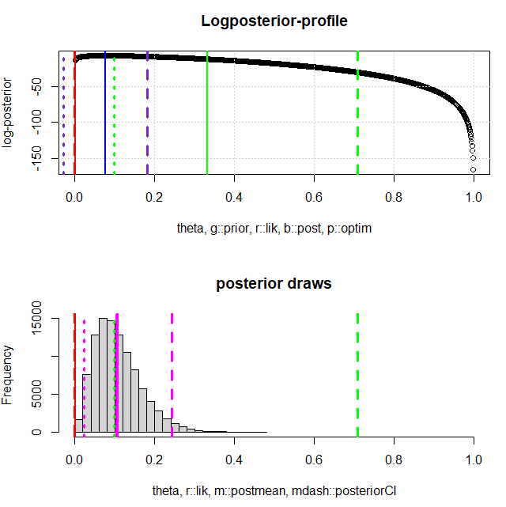

# Homework 1

## 1 Influence of dataset size and informative level of subjective priors

I use an extreme example, where the priors deviate drastically from the likelihood function to clearly demonstrate the effect of varying priors and dataset sizes. For this homework, I just indicate which parameter values I used (for N, p, alpha and beta), since I did not change the script "betabinomial.R" that was given in the lecture.

### 1.1 Large dataset and informative priors
N=500, p=0.3, alpha=70, beta=30

|  Method               | 2.5%   | point-estimate | 97.5%  | CI-length |
|-----------------------|--------|----------------|--------|-----------|
| **ML**                | 0.232  | 0.272          | 0.312  | 0.080     |
|**Bayes-normal-approx**| 0.304  | 0.343          | 0.382  | 0.078     |
| **Bayes**             | 0.306  | 0.343          | 0.382  | 0.076     |

The priors increase the point estimates noticeably, the uncertainty is not affected that much. However, the large data outweighs the priors, which can be seen in the following picture: 

The postmean (magenta) is about 0.35, while the priors (green) were quite different. Because the number of binomial tries is high with N=500, the postmean is rather far away from the priors, although they are informative. 

### 1.2 Large dataset and not very informative priors
N=500, p=0.3, alpha=1.5, beta=1.5

|  Method               | 2.5%   | point-estimate | 97.5%  | CI-length |
|-----------------------|--------|----------------|--------|-----------|
| **ML**                | 0.232  | 0.272          | 0.312  | 0.080     |
| **Bayes-normal-approx**| 0.233  | 0.272          | 0.312  | 0.080     |
| **Bayes**             | 0.235  | 0.273          | 0.313  | 0.078     |

- Likelihood function is very influential in shaping posterior distribution, because priors are not informative
- Result: The estimates of ML and Bayesian approaches are very similar, both should converge to true success rate 0.3

The informative levels of the priors can be seen by the following plot:

Left: Informative priors from 1.1. Right: Uninformative priors from 1.2.

Clearly, the interval from the informative priors is smaller than the interval for the uniformative priors. This is due to the fact, that the prior in 1.2 does not provide useful information where the parameter p lies. 

### 1.3 Small dataset and informative priors
N=20, p=0.3, alpha=70, beta=30

|  Method              | 2.5%  | Point Estimate | 97.5% | CI-length |
|----------------------|-------|----------------|-------|-----------|
| **ML**               | 0.056 | 0.250          | 0.444 | 0.387     |
| **Bayes-normal-approx** | 0.538 | 0.627          | 0.716 | 0.178     |
| **Bayes**            | 0.537 | 0.625          | 0.709 | 0.172     |

This case is most interesting. There is a huge difference between the point estimates of ML and Bayesian methods. This is driven by discrepancy between likelihood function and priors. The priors are informative, coupled with a small data size, the posterior mean is actually quite close to the priors.

The CIs are noticeably wider for the ML comapred to the Bayesian Methods.

### 1.4 Small dataset and not very informative priors
N=20, p=0.3, alpha=1.5, beta=1.5

|  Method              | 2.5%  | Point Estimate | 97.5% | CI-length |
|----------------------|-------|----------------|-------|-----------|
| **ML**               | 0.056 | 0.250          | 0.444 | 0.387     |
| **Bayes-normal-approx** | 0.070 | 0.262          | 0.454 | 0.384     |
| **Bayes**            | 0.123 | 0.283          | 0.478 | 0.356     |

- Priors again have little influence, because they are not informative
- The CIs are really huge, because of the small dataset size.

## 2 Classical vs. Bayesian Inference from small datasets with extreme probabilities
N=20, p=0.1, alpha=3, beta=5

|  Method              | 2.5%  | Point Estimate | 97.5% | CI-length |
|----------------------|-------|----------------|-------|-----------|
|ML                    |0.000  |        0.000| 0.000    | 0.000
|Bayes-normal-approx   |-0.028 |         0.077| 0.181   |  0.209
|Bayes                 |0.023  |        0.107| 0.242    | 0.219

**Classical vs. Bayesian Estimation in Small Datasets**: In small datasets with extreme success rates for Binomial Distribution, ML estimates are highly volatile, leading to large confidence intervals. In contrast, Bayesian inference stabilizes estimates by incorporating prior knowledge, making it more robust when data is limited. However, in my case, the MLE gets a point estimate of 0 and therefore also a confidence interval with length 0. This happens because none of the 20 binomial tries resulted in a success. This obviously is not ideal, as the true success rate is 10%.

**Evaluating the output table**: The table clearly shows some issues with classical inference, as the binomial with p=0.1 was never successfull in the 20 tries. In contrast, the priors in the Bayesian approach can stabilize the result and the point estimate of 0.107 is reasonable. The Bayesian normal approximation yields a somewhat unsensical interval with a lower bound of -0.028 which does not make sense in our application.

**Role of Priors in Bayesian Inference**: As summary, informative priors can significantly influence Bayesian estimates, especially with small sample sizes. An informative prior pulls estimates towards the prior belief, while an uninformative prior (e.g., Beta(1,1)) lets the data drive the estimates more, behaving more like ML.

The figure 3 visualizes the output table for the example in 2 (with N=20 and p=0.1). The image shows that MLE is 0, while the postmean is around 0.1 because of the influence of the priors.

## 3 MAP-based inference vs. simulation-based inference

**MAP in Small Datasets**: The prior plays a much larger role when the dataset is small, potentially dominating the posterior. The MAP estimate is a point estimate and doesn’t reveal the range of uncertainty, which can be problematic if the data is sparse and noisy. The advantage is that the MAP is computationally less expensive and can give an insight into the most likely parameter value.

**Simulation in Small Datasets**: Simulation-based inference can better handle small datasets by exploring the full posterior distribution. It provides credible intervals and shows how much uncertainty exists around the estimate. This is particularly useful when there’s not enough data to give strong confidence in the parameter value. The main drawback of simulation is the computational resources that are necessary. Although, this is probably less of an issue with the exponential increase in compute power over the last decades.
