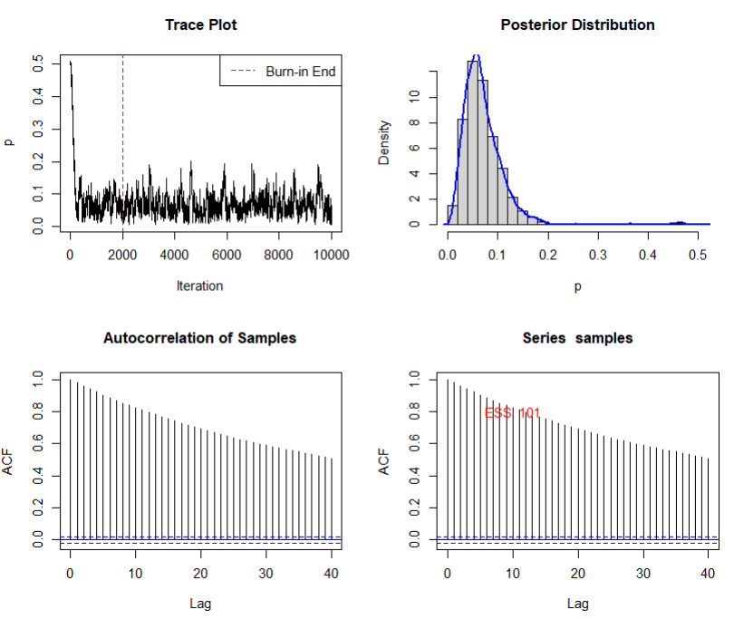
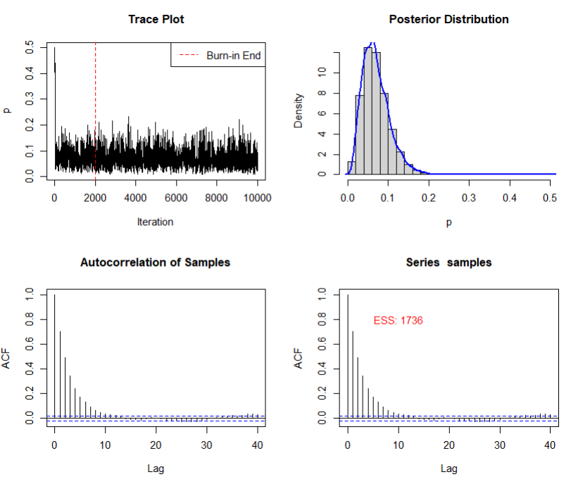
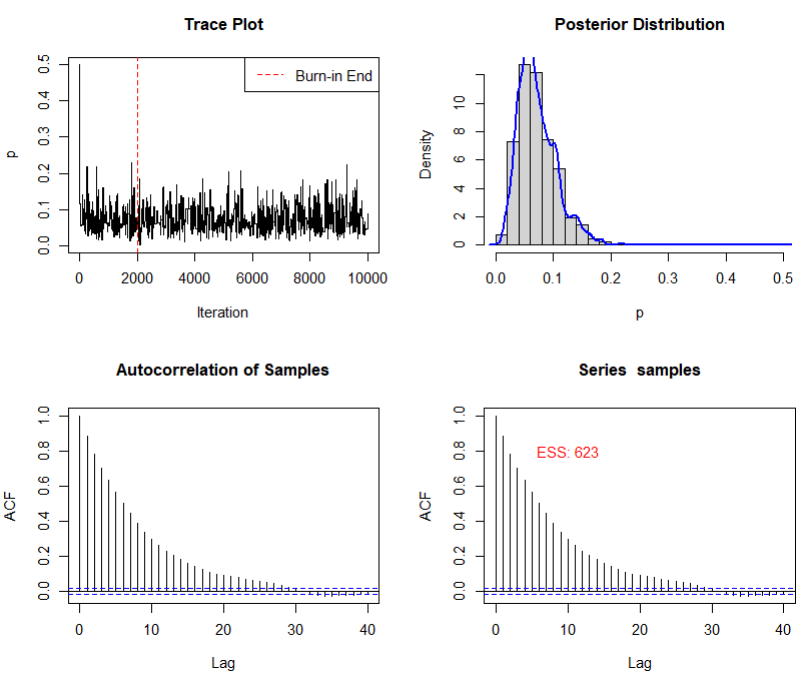
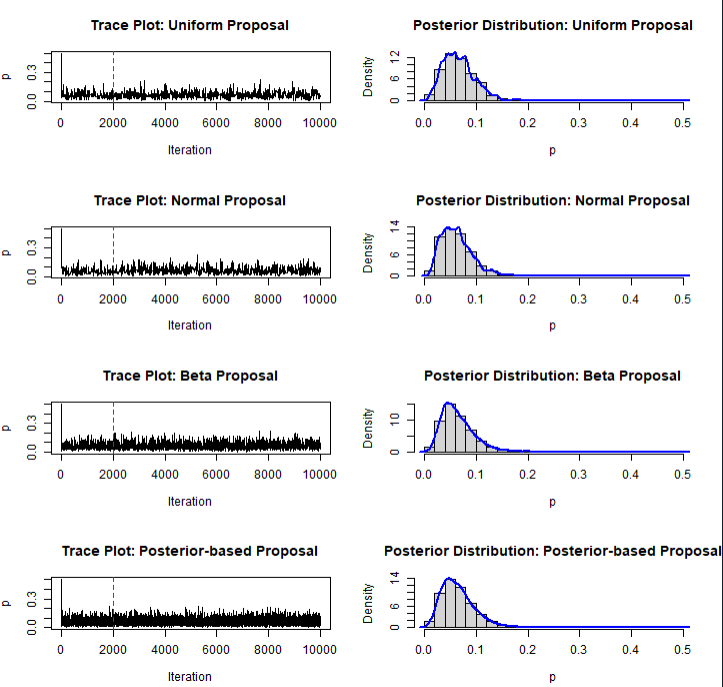
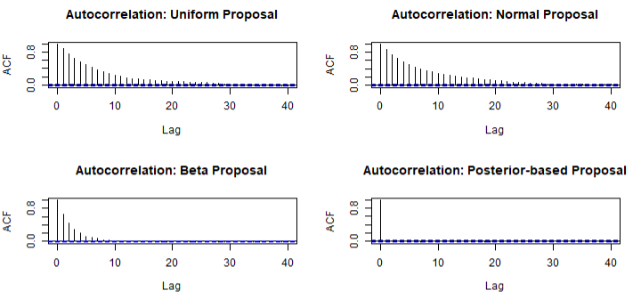
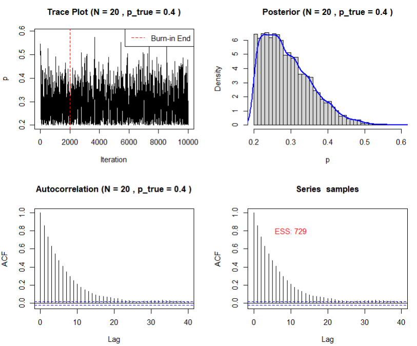
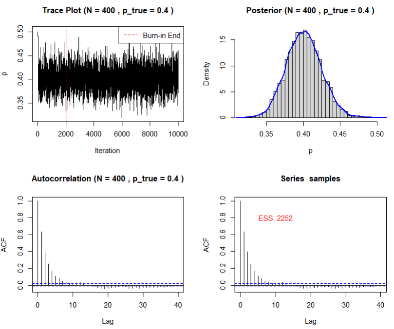
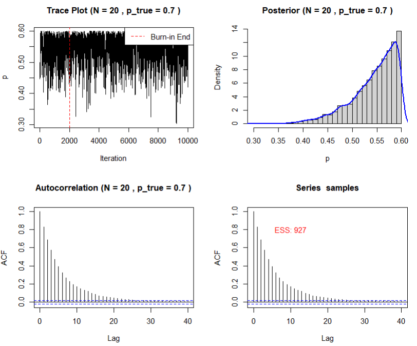
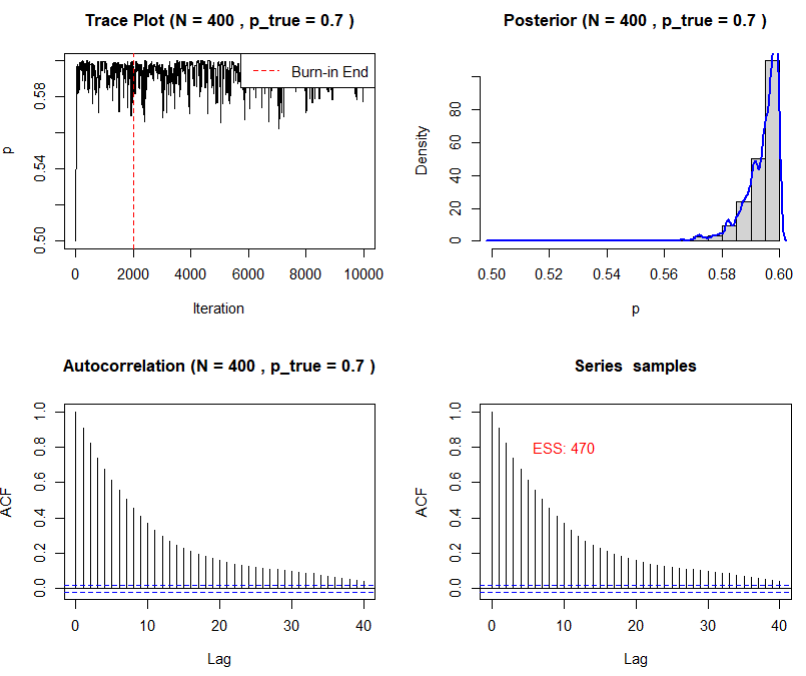

# Homework 2

## Task 1

The code for Task 1 can be found in the file "MH_Sampler.R". As parameter values, I chose p=0.1, N=50, alpha_prior=2, beta_prior=5. 

### Influence of different step sizes
For a very small step size of 0.01, the autocorrelation is high and therefore, the effective sample size (ESS) is very low.

In comparison, a step size of 0.10 reduces autocorrelation drastically, but the posterior distribution is very similar.

A higher step size of 0.40 again suffers from higher autocorrelation:

These findings suggest, that step sizes that are too high or too low negatively impact the performance of Metropolis Hastings (MH).

### Dropping normalizing constant

In the MH Algorithm, alpha represents the probability that the proposed state j will be accepted. The current state is given by i. The formula for the acceptance probability alpha is (from the lecture slides):

$$ \alpha = min [1, \frac{\pi_j q_{j,i}}{\pi_i q_{q,i}}]= min \left[1, \frac{\frac{\mathcal{L}(\theta_j) \, p(\theta_j)}{\sum_k \mathcal{L}(\theta_k) \, p(\theta_k)} \, q_{j,i}}{\frac{\mathcal{L}(\theta_i) \, p(\theta_i)}{\sum_k \mathcal{L}(\theta_k) \, p(\theta_k)}} \right] $$

As can be clearly seen, the normalizing constant of binomial likelihood and of the beta prior, $$ \sum_k \mathcal{L}(\theta_k) \, p(\theta_k) $$, appears twice in the term above and cancels out. This is the reason, why it has no effect on the ratio. In my MH_Sampler.R file in line 45, I calculate the ratio of the logs. Taking the formula from above with normalizing constant, I would add and subtract the normalizing constant (because of the logs, the product becomes a sum) and this would obviously not change the ratio. 

# Task 2

The following results are obtained using the script "MH_Sampler_truncated_beta.R". I created four different version, varying the parameters N (20 or 400) and p (0.4 or 0.7). My lower bound was 0.2 and my upper bound was 0.6. Hence, when p=0.7, the constraint is violated.

The results are presented visually (in the appendix) and numerically: 

### 2.1 Output for truncated beta for small sample size and corresponding constraint

|Quantile |     Value|
|:--------|---------:|
|2.5%     | 0.2041451|
|5%       | 0.2073012|
|50%      | 0.2782662|
|95%      | 0.4198934|
|97.5%    | 0.4505245|

### 2.2 Output for truncated beta for large sample size and corresponding constraint

|Quantile |     Value|
|:--------|---------:|
|2.5%     | 0.3558979|
|5%       | 0.3625588|
|50%      | 0.4003035|
|95%      | 0.4407573|
|97.5%    | 0.4498609|

### 2.3 Output for truncated beta for small sample size and violating constraint

|Quantile |     Value|
|:--------|---------:|
|2.5%     | 0.4258937|
|5%       | 0.4509072|
|50%      | 0.5559489|
|95%      | 0.5964529|
|97.5%    | 0.5985470|

### 2.4 Output for truncated beta for large sample size and violating constraint

|Quantile |     Value|
|:--------|---------:|
|2.5%     | 0.5783902|
|5%       | 0.5820232|
|50%      | 0.5955795|
|95%      | 0.5997594|
|97.5%    | 0.5998664|

### Summary of the Results
As can be expected, the posterior with corresponding constraint and large sample size performs the best, as we get a nice distribution around 0.4 which is also the true value of p. The posterior with corresponding constraint and small sample size is right skewed. This is just an effect of the small sample size. It seems as the lower bound slightly constrains the posterior because the success rate was well below 0.4 in the 20 binomial tries. Numerically, this can be seen by the fact that 2.5% of the observations are below 0.20 for case 2.1. 

For the cases 2.3 and 2.4, we can see that the posterior distribution "bounces against the upper bound". Especially for the large sample size, the entire posterior distribution is very close to 0.6. The posterior seems to be cut off at the upper bound of my truncated prior. 

# Task 3

For task 3, I wrote the script "MH_Independence_Sampler.R". There are four differenct distributions for the proposed densities: 1-uniform, 2-normal, 3-beta and 4-posterior distribution. The only iid sampler is the one with proposed densities from the posterior distribution. This sampler also does not have any autocorrelation. This can be seen in my script by the fact, that all 8000 samples were used and that the acceptance probability is equal to 99.99% (it should be 100%, maybe some kind of rounding error in R). For the other distributions, some proposed densities are not accepted and this gives rise to autocorrelation and it is also no iid sampler. 
The iid sampling property when using the posterior distribution can be also showed analytically. In the script "MetropolisLogit" on page 17, alpha becomes 1 if the proposed distribution is equal to current distribution:

$$ \alpha(\theta, \Theta) = min[1, \frac{\pi(\Theta)q(\theta)}{\pi(\theta)q(\Theta)}] $$

### Influence of distance between independence proposal and target distribution
The closer the independence proposal is to the target (posterior) distribution, the more efficient is our sampling process. This efficiency can be measured by the ESS, the autocorrelation and the acceptance rate. Here is an overview of ESS for the 4 distributions (rounded to the next integer): 

Effective Sample Size for Uniform Proposal: 521
Effective Sample Size for Normal Proposal: 607
Effective Sample Size for Beta Proposal: 1707
Effective Sample Size for Posterior-based Proposal: 8000

As can be seen, the Posterior proposal has by far the largest ESS. 

Accordingly, there is no autocorrelation for the iid sampler and only little autocorrelation for the Beta Proposal:

\clearpage
\newpage

# Appendix

